## Link Game Report
* Work by **_Lin, Tzu-Heng_**, Dept. of Electronic Engineering, Tsinghua University
    * **清华大学 电子工程系 无42 林子恒 2014011054**
    * Email: _**lzhbrian@gmail.com**_ / _**linzh14@mails.tsinghua.edu.cn**_
* See My Github [Repository of This Project](https://github.com/lzhbrian/Link-Game)

### 目录 Content:

***

1. 第一章：制作自己的连连看 `linkgame/`
	1. 熟悉游戏
	2. 连连看逻辑 `detect.m`
	3. 外挂模式 `omg.m`, `play_omg.mov`
2. 第二章：攻克别人的连连看 `process/`
	1. 分割 graygroudtruth `extract_gray.m`
	2. 分割 graycature `extract_gray.m`
	3. 计算相似性，选出最相似的十对图像块 `match_patterns.m`, `Show_10.m`
	4. 找出相似度最大却不是同一种精灵的十对图像快 `Show_10.m`
	5. 列出索引值和图像分块的对照关系表 `get_mtx.m`
	6. 设计一个模拟的自动连连看 `sim_play.m`, `sim_play.mov`
3. 原创性声明
4. 写在最后
5. 源程序

### 1. 第一章：制作自己的连连看 `linkgame/`
*** 

#### 1.1 熟悉游戏
* 熟悉啦～
* 最近还很疯 Pokemon Go，正好应景～

#### 1.2 连连看逻辑 `detect.m`
* 本题按照题目里介绍所提供的算法实现即可
* 考虑三种情况：直线连、拐弯连、拐俩弯连
	* 首先是 直线连 的情况
		* 只需要判断两个方块是否都在同一条直线上，同时两者之间没有任何方块
		* 关键代码如下：

				function bool = directline(mtx, x1, y1, x2, y2)
					% Initialize
					bool = 0;
					flag = 0;
					% Horizontal
					if x1 == x2
						if abs(y1-y2) == 1
							flag = 0;
						elseif y1 < y2
							for i = (y1+1):(y2-1)
								if mtx(x1, i) ~= 0
									flag = 1;
								end
							end
						elseif y1 > y2
							for i = (y2+1):(y1-1)
								if mtx(x1, i) ~= 0
									flag = 1;
								end
							end
						end
						if flag == 0
							bool = 1;
						end
					% Vertical
					elseif y1 == y2
						if abs(x1-x2) == 1
							flag = 0;
						elseif x1 < x2
							for i = (x1+1):(x2-1)
								if mtx(i, y1) ~= 0
									flag = 1;
								end
							end
						elseif x1 > x2
							for i = (x2+1):(x1-1)
								if mtx(i, y1) ~= 0
									flag = 1;
								end
							end
						end
						if flag == 0
							bool = 1;
						end
					end
				end
				
	* 接下来是 拐弯连 的情况
		* 将两块延横、纵向分别延伸，得到会得到一个交点
		* 我们只需分别判断该交点对应的方块是否与两者都可以 直线连 `directline()` ，且该方块为空即可
		* 关键代码如下：
		
				function bool = one_turn(mtx, x1, y1, x2, y2)
					bool = 0;
					% Intersection 1
					first_situation = directline(mtx, x1, y1, x2, y1) ...
								& directline(mtx, x2, y2, x2, y1) ...
								& (mtx(x2, y1) == 0);
					% Intersection 2
					second_situation= directline(mtx, x1, y1, x1, y2) ...
								& directline(mtx, x2, y2, x1, y2) ...
								& (mtx(x1, y2) == 0);
					bool = first_situation | second_situation;
				end
	
	
	* 最后是 拐俩弯连
		* 此种情况的逻辑较为复杂，
			* 首先，将两目标块的其中一块延横、纵向分别延伸直到尽头
			* 接下来，判断这些延伸所经过的块是否可以与另一目标块 拐弯连 `one_turn()`，且该块为空即可 
		* 为实现上述逻辑，首先我们需要将整个游戏区域向外扩张一个块，因为上述第二步延伸出去的块可能会出现在当前游戏区域外。
					
				[m, n] = size(mtx);		
				% Augment
				augmented_mtx = [mtx;zeros(1,n)]; % down
				augmented_mtx = [augmented_mtx zeros(m+1,1)]; % right
				augmented_mtx = [zeros(1,n+1);augmented_mtx]; % up
				augmented_mtx = [zeros(m+2,1) augmented_mtx]; % left
		
		* 接下来，因为我们扩张了游戏区域，所以对应的目标块的坐标也要改变
			
				% Alter position due to augment
				x1 = x1 + 1;
				y1 = y1 + 1;
				x2 = x2 + 1;
				y2 = y2 + 1;
		
		* 最后，往俩方向延伸并进行判断是否可与另一目标块进行 拐弯连 `one_turn()`
				
				% Prolong
				[m, n] = size(augmented_mtx);
				for i = 1:m
					if (augmented_mtx(i,y1) == 0) & ...
						directline(augmented_mtx,i,y1,x1,y1) 
					% Check if valid prolonged
						if one_turn(augmented_mtx,i,y1,x2,y2) 
						% check if can one_turn 
							flag = 1;
							break;
						end
					end
				end
				if flag == 0
					for i = 1:n
						if (augmented_mtx(x1,i) == 0) & ...
							directline(augmented_mtx,x1,i,x1,y1) 
						% Check if valid prolonged
							if one_turn(augmented_mtx,x1,i,x2,y2) 
							% check if can one_turn 
								flag = 1;
								break
							end
						end
					end
				end
				% Final
				if flag == 1
					bool = 1;
				end

* 最终，将所有函数在 `detect.m` 中正确调用：

		function bool = detect(mtx, x1, y1, x2, y2)
		    [m, n] = size(mtx);
		    if ~( (x1 == x2) & (y1 == y2) )
			    if mtx(x1, y1) == mtx(x2, y2)
			    	bool = directline(mtx, x1, y1, x2, y2) | ...
			    			one_turn(mtx, x1, y1, x2, y2) | ...
			    			two_turn(mtx, x1, y1, x2, y2);
				else
					bool = 0;
				end
			else
			    bool = 0;
			end
		end

#### 1.3 外挂模式 `omg.m` `play_omg.mov`

* 本题的解题思路如下：
	* 首先创建 `length(pattern)` 个数组，每个数组保存对应 pattern 在 `[mtx]` 中的位置
			
			% An array of unique pattern number
		    patterns = unique(mtx);
		
		    % Make each array with specific pattern
		    for i = 1:length(patterns)
		        p = patterns(i);
		        if p ~= 0
		            target_array = [];
		
		            target = find(mtx == p);
		            for x = 1:length(target)
		                y = target(x);
		                target_array = [target_array, y];
		            end
		            eval(['target_array_' num2str(p) '=target_array;']); 
		            % target_array_1 = target_array;
		        end
		    end
		    
	* 接下来 遍历所有 pattern，每个 pattern 都遍历一遍该pattern数组里的俩俩目标是否可以消去
		     
		    % Run through all patterns each time
	        for i = 1:length(patterns)
	            p = patterns(i);
	            if p ~= 0
	                
	                eval(['target_array=target_array_' num2str(p) ';']); 
	                % target_array = target_array_1;
	                
	                break_flag = 0;
	                for j = 1:length(target_array)
	                    t = target_array(j);
	
	                    m1 = mod(t, m);
	                    n1 = ceil(t/m);
	                    if m1 == 0
	                        m1 = m;
	                    end
	                    
	                    for l = 1:length(target_array)
	                        r = target_array(l);
	
	                        m2 = mod(r, m);
	                        n2 = ceil(r/m);
	                        if m2 == 0
	                            m2 = m;
	                        end
	                        
	                        % if can match
	                        if detect(mtx, m1, n1, m2, n2)
	                            steps = [steps, m1, n1, m2, n2];
	                            
	                            % Delete item
	                            target_array([j,l]) = [];
	                            mtx([t,r]) = 0;
	
	                            break_flag = 1;
	                            break;
	                        end
	                    end
	                    
	* 每次检查是否可以消除后，需要将消去的块在对应的 pattern 数组里消去
			
			target_array([j,l]) = [];
			mtx([t,r]) = 0;
			
			eval(['target_array_' num2str(p) '=target_array;']);

	* 同时检查是否该 pattern 的数组已经被消完，若没有，则置 `continue_flag = 1`，表示还要再继续重新遍历一次全部的 pattern

	* 最后，若 `continue_flag == 1`，则再重复遍历所有 pattern

	* 同时，根据题目要求，将返回的 `[steps]` 数组第一项置为总步数
	
			steps = [length(steps)/4, steps];
			
* 测试：
	* 因为本人使用 Mac 系统，即使开 Windows 虚拟机也无法正常使用老师所提供的按键精灵
	* 所以本人在测试时使用了 *__林梓楠 学长__* 在去年所开发的[ 游戏平台 fjxmlzn/linkgame-platform (github) ](https://github.com/fjxmlzn/linkgame-platform)，此平台将按键调用集成在 Matlab 内部，不需调用外部程序即可使用。
	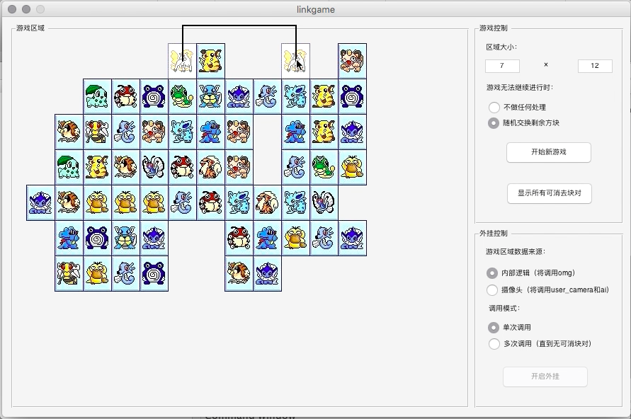
	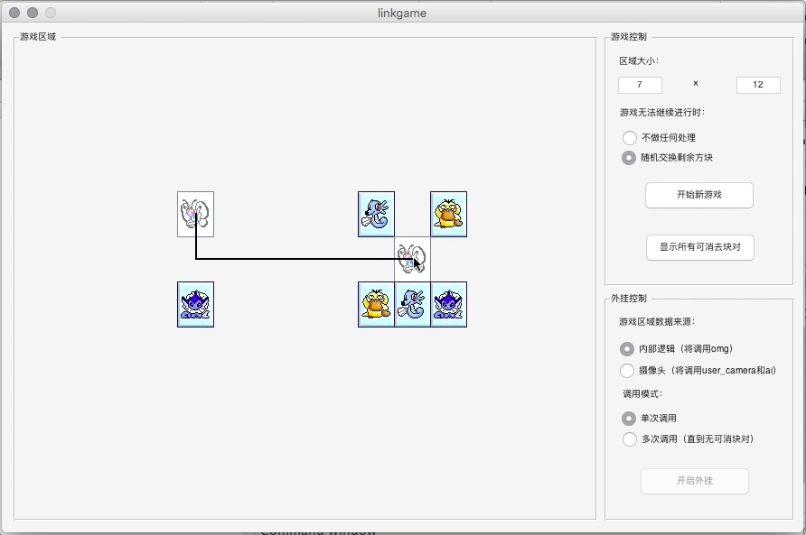
	* 本题最后的视频结果可以观看: `play_omg.mov`
	* 可以看到，我所写的 `detect.m` 以及 `omg.m` 完美的开启了外挂模式

### 2. 第二章：攻克别人的连连看 `process/`
*** 

#### 2.1 分割 graygroudtruth `extract_gray.m`

* 首先对图片的所有横向向量取平均
		
		vertical_mean_vec = mean( pic - mean(mean(pic)) ) ;

* 采用跟之前 音乐合成实验 时候一样的 `fft()`, `find_base()` 方法，这里不再赘述；找到上述 `vertical_mean_vec` 的基频，并用 `cos()` 辅助呈现周期：
* 计算左侧空白大小的方法是，用幅度谱峰值处对应的相位 * 周期：

		v_s = angle(base) * 180/pi / 360 * v_period;

* 这一部分全部关键代码如下：

	    v_len = length(vertical_mean_vec);
	    f = [0:v_len-1] / v_len;
	
	    base_position = find_base(freq_domain);
	    v_period = round(1 / f(base_position));
	
	    base = freq_domain(base_position);
	
	    v_s = angle(base) * 180/pi / 360 * v_period;
	
	    % Draw segment on cos
	    a = 80 * cos(2 * pi / v_period * ( [0:v_len-1] + v_s ));
	    hold on;plot(a)

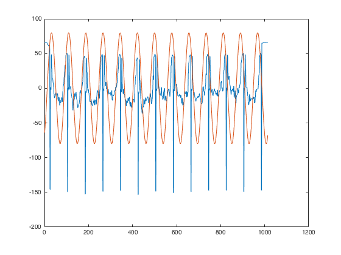

* 对纵向也做一样的处理：

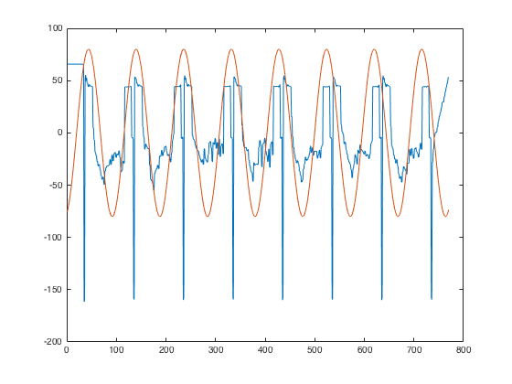

* 最后，用 `subplot()` 画出对应的 7x12个分块
    
	    % Draw output final split images
	
	    row_len = round(v_len/v_period); % 13
	    col_len = floor(h_len/h_period); % 8
	
	    figure;
	    row = abs(round(v_s)); % 31
	    row_initial = row;
	    col = abs(round(h_s)); % 43
	    for i = 1 : col_len-1
	        for j = 1 : row_len-1
	            subplot(col_len-1, row_len-1, (i-1)*(row_len-1) + j );
	            imshow( original_pic( col:col+h_period, row:row+v_period ) );
	            target{(i-1)*(row_len-1) + j} = ...
	                original_pic( col:col+h_period, row:row+v_period );
	            row = row + v_period;
	        end
	        row = row_initial;
	        col = col + h_period;    
	    end
	
	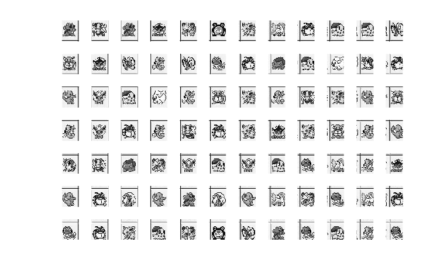
	
	* 由上图，使用此方法较好的分出了 7x12 个方块

#### 2.2 分割 graycature `extract_gray.m`

* 代码与上题完全相同
* 分出结果如下，可见使用傅立叶变换进行分析的代码具有鲁棒性：

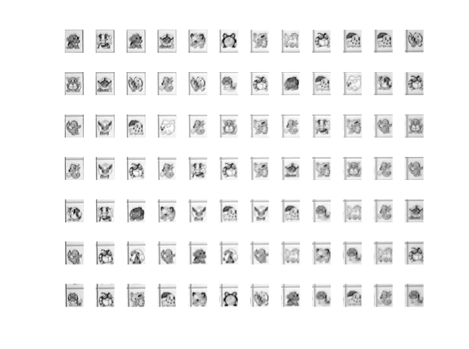

#### 2.3 计算相似性，选出最相似的十对图像块 `match_patterns.m` `Show_10.m`

* 根据题目里给出的提示，我们首先对图像进行高通滤波，使用 `fir1()` 先生成一个一维的高通滤波器，然后再手动把它变为二维的；最后使用 `filter2()` 函数进行滤波：

		% High Pass
		function high_passed_image = high_pass(img)
		
		    % 1 dim high pass
		    dim_1_filter = fir1(10, 0.5, 'high');
		    
		    % initialize for 2 dim
		    dim_2_filter = zeros(order + 1);
		    % Generate 2 dim filter
		    middle = order/2 + 1;
		    for row = 1 : order+1
		        for col = 1 : order+1
		            d = round( sqrt( (row-middle)^2 + (col-middle)^2 ) );
		            if d > middle - 1
		                dim_2_filter(row,col) = 0;
		            else
		                dim_2_filter(row,col) = dim_1_filter(middle-r);
		            end
		        end
		    end
		    
		    % filter
		    high_passed_image = filter2(dim_2_filter, img);
		    
		end

* 在对图像进行高通滤波后，计算两图片间相似性的方法为 调用 matlab 里一个强大的 `normxcorr2()` 函数，根据 help 里的指示，第一个参数传入的图片 需要比 第二个参数传入的图片小
* 于是我们 主动丢失在图片边缘 10% 的部分
	* 这么做还有一个好处是只取到了每个方块最重要的部分，同时也丢失掉了我在上面的题目里分得不是特别好的有一些边框的信息
* 分别对 图片1，图片2 做上述的事情并与另一者 计算 `normxcorr2()`，取所有值里的最大值作为两者的 相关性

	    % Calculate Cor using mormxcorr2
	    cor_1 = normxcorr2(...
	        im1(up_margin:down_margin,...
	            left_margin:right_margin), im2);
	    cor_2 = normxcorr2(...
	        im2(up_margin:down_margin,...
	            left_margin:right_margin), im1);
	    cor_max = max( max(max(cor_1)), max(max(cor_2)) );

* 最后画出 相似性最高的 10对方块：`Show_10.m`

		Show_10(Similarity, target, 1);

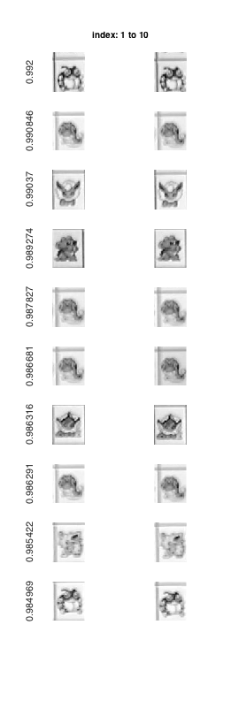

#### 2.4 找出相似度最大却不是同一种精灵的十对图像块 `Show_10.m`

* 利用人工查找的方法，得知第 183 ~ 191 对为相似度最大却不是同一种精灵的十对图像块
	
		Show_10(Similarity, target, 181);
		Show_10(Similarity, target, 191);

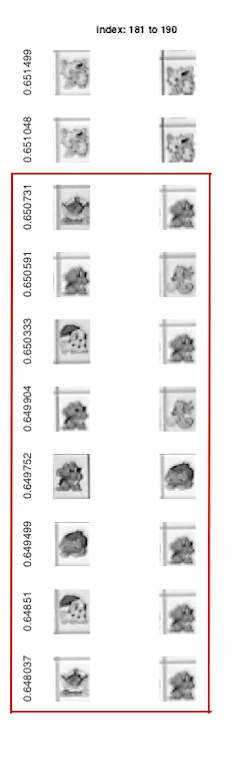
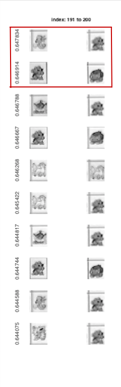

* 可以直观地看到，被错误判定成同一个 pattern 的两个图像，其实本质上来讲，真的是蛮像的...外面的轮廓都差不多，中间都是一坨...
	* 我相信如果是近视眼来看，也分不太清楚它们...
* 可见 graycapture 的模糊程度很大程度上地影响到了图像的判断

#### 2.5 列出索引值和图像分块的对照关系表 `get_mtx.m`

* 编写 `get_mtx` 函数，传入已经计算好的 `[84x84 Similarity]`, `{1x84 target图像}`, `(取相似度的阈值 threshold)`
	* 这里 `threshold` 经测试我们取 0.8 就可以完美地分辨出所有 pattern 了，根据上题，其实此值可以取到 0.6x
* 维护一个 `[1x84 mtx]` 矩阵，对应到游戏区域的 84 个方块，先初始化为 0
* 由大到小遍历 `[Similarity]` 数组
	* 若该两目标方块 值都为0，则将其赋值为 还没有赋过的 最小数字
	* 若该两目标方块 仅有一个值为 0，则将其赋为另一方块对应的值
	* 若该两目标方块 值都不为 0，则将两个当中任一方块对应值 在 [mtx] 里出现的位置全部赋为另外一个方块的值

			% New pattern
			if ( mtx(p1_index) == 0 ) & ( mtx(p2_index)==0 )
			    mtx(p1_index) = pattern_num;
			    mtx(p2_index) = pattern_num;
			    pattern_num = pattern_num + 1;
			    
			% One new, one old    
			elseif mtx(p1_index) == 0
			    mtx(p1_index) = mtx(p2_index);                    
			elseif mtx(p2_index) == 0
			    mtx(p2_index) = mtx(p1_index); 
			    
			% Conflict
			elseif mtx(p1_index) ~= mtx(p2_index)
			    mtx( find(mtx==mtx(p1_index)) ) = mtx(p2_index);
			end
	
* 最后，将 `[mtx]` 矩阵里的元素能取小就取小，这步的原因是因为在上一步时我的算法可能会导致最后结果出现有比如 1,3:18,20 这种情况
* 然而我们希望他最后的结果是 1:19
		
		% Make sure the pattern # is the smallest
		for i = 1:length( unique(mtx) )
		    max_patternnum = max(mtx);
		    if length( find(mtx == i) )==0
		        mtx( find(mtx==max_patternnum) )=i;
		    end
		end

* 最后，画出所有的 pattern 结果，并返回一个 [7x12 mtx]

		% Draw patterns
		figure;
		for i = 1:length( unique(mtx) )
		    temp = target{ find(mtx==i,1) };
		    subplot(4,5,i);
		    imshow(temp);
		    title(['index: ' num2str(i)])
		end
		% Reshape into 7x12
    	mtx = reshape(mtx, [12,7]);
    	mtx = mtx' ;

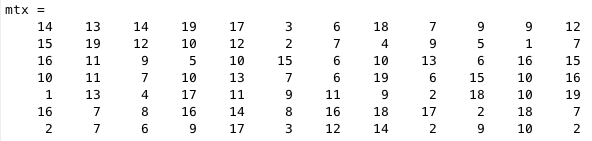
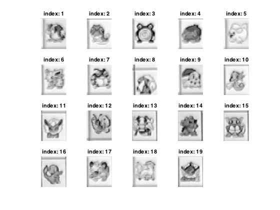

#### 2.6 设计一个模拟的自动连连看 `sim_play.m` `sim_play.mov`

* 编写 `sim_play` 函数，传入之前计算好的游戏矩阵 `[mtx]`，以及分割好后的 84个图像块 `{target}`

* 调用 `omg.m`，得到消去的步骤数组 `[steps]`。遍历数组，对每一步的两个目标块进行操作

		steps = omg(mtx);
    	step_num = steps(1);
    	for i = 1:step_num
        	x1 = steps( (i-1)*4+2 );
        	y1 = steps( (i-1)*4+3 );
        	x2 = steps( (i-1)*4+4 );
        	y2 = steps( (i-1)*4+5 ); 

* 在游戏区域的下方显示当前要消去的两个方块的图像
		
		% Show two target
		subplot( 8,12, 85:90 );
		imshow(target{x1,y1});title('target 1');
		subplot( 8,12, 91:96 );
		imshow(target{x2,y2});title('target 2');

* 同时将该两方块在原图像中涂黑。

		% Erase the two targets
		subplot( 8,12, (x1-1)*12+y1 );
		imshow(zeros(66,54));
		subplot( 8,12, (x2-1)*12+y2 );
		imshow(zeros(66,54));

* 停留0.3秒，以方便我们进行观察结果是否正确
	
		% Pause for 0.3 second
		pause(0.3);

* 自动连连看过程截图：
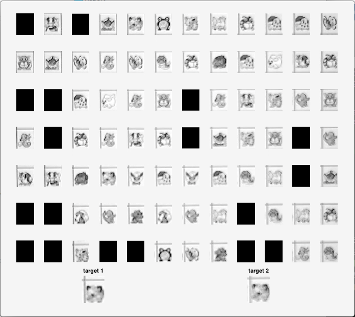
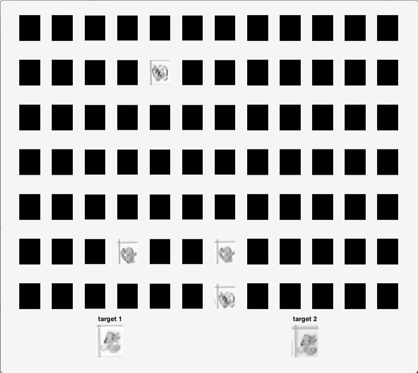

* 本题最后的视频结果，详细全过程可以观看 `sim_play.mov`
* 从截图、视频中可以看到，已经成功的实现了模拟的自动连连看

### 3. 原创性声明
***
* 因为本人使用的为 Mac 系统，无法使用老师提供的按键精灵等一套系统
* 所以在验证 `omg.m` 的正确性时，使用了 *__林梓楠 学长__* 在 github 上的一个 [开源仓库 fjxmlzn/linkgame-platform](https://github.com/fjxmlzn/linkgame-platform) 
	* 林梓楠 学长在此仓库里解决了需要调用外部软件即按键精灵的麻烦，非常令人感动的工作，本来我以为要装 Windows 版本的 Matlab了 QAQ。
* 除了调用上述游戏平台外，其余内容、代码均为本人原创。

### 4. 写在最后
***

* 很多人说 Matlab 写久了，编程能力会变弱... 我觉得他们说的没错，不过还是真心觉得 Matlab 好强大
* 这次的实验两个很大的难点 在 分割图像 以及 计算 相似性。
	* 分割图像那一块弄了我非常久的时间，因为对 `fft()` 以及 相位谱 的概念理解的不够深刻，导致我吃了很多苦头；
	* 在计算相似性这边我则是尝试了很多方法，但都发现可能在第 30-40 对的时候就没办法正确辨别了，最后实现的这个方法才可以正确的实现到180多对。
* 这个暑假我过得很充实，编程能力有了质的飞跃 ~
* 最后，谢谢老师、助教这一学期的照顾！

### 5. 源程序
***

1. 第一章：制作自己的连连看 `linkgame/`
	1. 熟悉游戏
	2. 连连看逻辑 `detect.m`
	3. 外挂模式 `omg.m`, `play_omg.mov`
2. 第二章：攻克别人的连连看 `process/`
	1. 分割 graygroudtruth `extract_gray.m`
	2. 分割 graycature `extract_gray.m`
	3. 计算相似性，选出最相似的十对图像块 `match_patterns.m`, `Show_10.m`
	4. 找出相似度最大却不是同一种精灵的十对图像快 `Show_10.m`
	5. 列出索引值和图像分块的对照关系表 `get_mtx.m`
	6. 设计一个模拟的自动连连看 `sim_play.m`, `sim_play.mov`

* 1.1 `detect.m`

		function bool = detect(mtx, x1, y1, x2, y2)
		    % ========================== 参数说明 ==========================
		    
		    % 输入参数中，mtx为图像块的矩阵，类似这样的格式：
		    % [ 1 2 3;
		    %   0 2 1;
		    %   3 0 0 ]
		    % 相同的数字代表相同的图案，0代表此处没有块。
		    % 可以用[m, n] = size(mtx)获取行数和列数。
		    % (x1, y1)与（x2, y2）为需判断的两块的下标，
		    	% 即判断mtx(x1, y1)与mtx(x2, y2)
		    % 是否可以消去。
		    
		    % 注意mtx矩阵与游戏区域的图像不是位置对应关系。下标(x1, y1)在连连看界面中
		    % 代表的是以左下角为原点建立坐标系，x轴方向第x1个，y轴方向第y1个
		    
		    % 输出参数bool = 1表示可以消去，bool = 0表示不能消去。
		    
		    %% 在下面添加你的代码O(∩_∩)O
		    
		    [m, n] = size(mtx);
		    if ~( (x1 == x2) & (y1 == y2) )
			    if mtx(x1, y1) == mtx(x2, y2)
			    	bool = directline(mtx, x1, y1, x2, y2) | ...
			    			one_turn(mtx, x1, y1, x2, y2) | ...
			    			two_turn(mtx, x1, y1, x2, y2);
				else
					bool = 0;
				end
			else
			    bool = 0;
			end
		end
		
		function bool = directline(mtx, x1, y1, x2, y2)
			
			% Initialize
			bool = 0;
			flag = 0;
		
			% Horizontal
			if x1 == x2
				if abs(y1-y2) == 1
					flag = 0;
				elseif y1 < y2
					for i = (y1+1):(y2-1)
						if mtx(x1, i) ~= 0
							flag = 1;
						end
					end
				elseif y1 > y2
					for i = (y2+1):(y1-1)
						if mtx(x1, i) ~= 0
							flag = 1;
						end
					end
				end
				if flag == 0
					bool = 1;
				end
			% Vertical
			elseif y1 == y2
				if abs(x1-x2) == 1
					flag = 0;
				elseif x1 < x2
					for i = (x1+1):(x2-1)
						if mtx(i, y1) ~= 0
							flag = 1;
						end
					end
				elseif x1 > x2
					for i = (x2+1):(x1-1)
						if mtx(i, y1) ~= 0
							flag = 1;
						end
					end
				end
				if flag == 0
					bool = 1;
				end
			end
		end
		
		function bool = one_turn(mtx, x1, y1, x2, y2)
			bool = 0;
			% Intersection 1
			first_situation = directline(mtx, x1, y1, x2, y1) ...
							& directline(mtx, x2, y2, x2, y1) ...
							& (mtx(x2, y1) == 0);
			% Intersection 2
			second_situation= directline(mtx, x1, y1, x1, y2) ...
							& directline(mtx, x2, y2, x1, y2) ...
							& (mtx(x1, y2) == 0);
			bool = first_situation | second_situation;
		end
		
		function bool = two_turn(mtx, x1, y1, x2, y2)
			flag = 0;
			bool = 0;
			[m, n] = size(mtx);
			
			% Augment
			augmented_mtx = [mtx;zeros(1,n)]; % down
			augmented_mtx = [augmented_mtx zeros(m+1,1)]; % right
			augmented_mtx = [zeros(1,n+1);augmented_mtx]; % up
			augmented_mtx = [zeros(m+2,1) augmented_mtx]; % left
		
			% Alter position due to augment
			x1 = x1 + 1;
			y1 = y1 + 1;
			x2 = x2 + 1;
			y2 = y2 + 1;
			
			% Prolong
			[m, n] = size(augmented_mtx);
			for i = 1:m
				if (augmented_mtx(i,y1) == 0) & ...
					directline(augmented_mtx,i,y1,x1,y1) 
				% Check if valid prolonged
					if one_turn(augmented_mtx,i,y1,x2,y2) 
					% check if can one_turn 
						flag = 1;
						break;
					end
				end
			end
			if flag == 0
				for i = 1:n
					if (augmented_mtx(x1,i) == 0) & ...
						directline(augmented_mtx,x1,i,x1,y1) 
					% Check if valid prolonged
						if one_turn(augmented_mtx,x1,i,x2,y2) 
						% check if can one_turn 
							flag = 1;
							break
						end
					end
				end
			end
			% Final
			if flag == 1
				bool = 1;
			end
		end

* 1.2 `omg.m`

		function steps = omg(mtx)
		    % -------------- 输入参数说明 --------------
		    
		    %   输入参数中，mtx为图像块的矩阵，类似这样的格式：
		    %   [ 1 2 3;
		    %     0 2 1;
		    %     3 0 0 ]
		    %   相同的数字代表相同的图案，0代表此处没有块。
		    %   可以用[m, n] = size(mtx)获取行数和列数。
		    
		    %   注意mtx矩阵与游戏区域的图像不是位置对应关系。
		    %   下标(x1, y1)在连连看界面中
		    %   代表的是以左下角为原点建立坐标系，x轴方向第x1个，y轴方向第y1个
		    
		    % --------------- 输出参数说明 --------------- %
		    
		    %   要求最后得出的操作步骤放在steps数组里,格式如下：
		    %   steps(1)表示步骤数。
		    %   之后每四个数x1 y1 x2 y2，
		    %   代表把mtx(x1,y1)与mtx(x2,y2)表示的块相连。
		    %   示例： steps = [2, 1, 1, 1, 2, 2, 1, 3, 1];
		    %   表示一共有两步，第一步把mtx(1,1)和mtx(1,2)表示的块相连，
		    %   第二步把mtx(2,1)和mtx(3,1)表示的块相连。
		    
		    %% --------------  请在下面加入你的代码 O(∩_∩)O~  ------------
		    steps = [];
		    [m, n] = size(mtx);
		    
		    % An array of unique pattern number
		    patterns = unique(mtx);
		
		    % Make each array with specific pattern
		    for i = 1:length(patterns)
		        p = patterns(i);
		        if p ~= 0
		            target_array = [];
		
		            target = find(mtx == p);
		            for x = 1:length(target)
		                y = target(x);
		                target_array = [target_array, y];
		            end
		            eval(['target_array_' num2str(p) '=target_array;']); 
		            % target_array_1 = target_array;
		        end
		    end
		
		    % Start matching
		    continue_flag = 1;
		    while (continue_flag == 1) % Check if it is all done
		        continue_flag = 0;
		
		        % Run through all patterns each time
		        for i = 1:length(patterns)
		            p = patterns(i);
		            if p ~= 0
		                
		                eval(['target_array=target_array_' num2str(p) ';']); 
		                % target_array = target_array_1;
		                
		                break_flag = 0;
		                for j = 1:length(target_array)
		                    t = target_array(j);
		
		                    m1 = mod(t, m);
		                    n1 = ceil(t/m);
		                    if m1 == 0
		                        m1 = m;
		                    end
		                    
		                    for l = 1:length(target_array)
		                        r = target_array(l);
		
		                        m2 = mod(r, m);
		                        n2 = ceil(r/m);
		                        if m2 == 0
		                            m2 = m;
		                        end
		                        
		                        % if can match
		                        if detect(mtx, m1, n1, m2, n2)
		                            steps = [steps, m1, n1, m2, n2];
		                            
		                            % Delete item
		                            target_array([j,l]) = [];
		                            mtx([t,r]) = 0;
		
		                            break_flag = 1;
		                            break;
		                        end
		                    end
		
		                    % Check if it is all done in this pattern
		                    if break_flag == 1
		                        eval(['target_array_' num2str(p) '=target_array;']);
		                        % target_array_1 = target_array;
		
		                        if length(target_array) ~= 0
		                            continue_flag = 1;
		                        end
		                        
		                        break;
		                    else
		                        if length(target_array) ~= 0
		                            continue_flag = 1;
		                        end
		                    end
		
		                end
		
		            end
		        end
		
		    end
		    steps = [length(steps)/4, steps];
	
		end

* 2.1, 2.2 `extract_gray.m`

		% Split the image
		    % Input 
		        % filepath = 'graygroundtruth.jpg';
		        % filepath = 'graycapture.jpg';
		        % filepath = '/Users/Brian/Desktop/link_game/process/graygroundtruth.jpg';
		        % filepath = '/Users/Brian/Desktop/link_game/process/graycapture.jpg';
		    % Output
		        % {target: 1x84 cell} 
		        % Show: 12*7 target pictures
		        
		% Usage:
		    % extract_gray('/Users/Brian/Desktop/link_game/process/graygroundtruth.jpg');
		    % extract_gray('/Users/Brian/Desktop/link_game/process/graycapture.jpg');
		    
		function target = extract_gray(filepath)
		
		    close all;
		
		    target = {};
		    original_pic = imread(filepath, 'jpg');
		    pic  = double(original_pic);
		        % imshow(pic);
		
		    %%%%%%%%%%%%%%%%%%%%%%%%%%%%%%%%%%%%%%
		    % Vertical
		    % Caluculate mean in vertical
		    vertical_mean_vec = mean( pic - mean(mean(pic)) ) ;
		        figure;
		        plot(vertical_mean_vec);
		    %     xlim([-5 1020]);ylim([-160 120]);
		
		    % FFT
		    freq_domain = fft(vertical_mean_vec);
		
		    % Half
		    freq_domain = freq_domain(1:ceil(length(freq_domain) / 2));
		    %     figure;
		    %     plot(abs(freq_domain));
		
		    v_len = length(vertical_mean_vec);
		    f = [0:v_len-1] / v_len;
		
		    base_position = find_base(freq_domain);
		    v_period = round(1 / f(base_position));
		
		    base = freq_domain(base_position);
		
		    v_s = angle(base) * 180/pi / 360 * v_period;
		
		    % Draw segment on cos
		    a = 80 * cos(2 * pi / v_period * ( [0:v_len-1] + v_s ));
		    hold on;plot(a)
		
		
		    %%%%%%%%%%%%%%%%%%%%%%%%%%%%%%%%%%%%%%
		    % Horizontal
		    % Caluculate mean in horizontal
		    horizontal_mean_vec = mean( pic - mean(mean(pic)) , 2) ;
		        figure;
		        plot(horizontal_mean_vec);
		    %     xlim([-5 800]);ylim([-160 120]);
		
		    % FFT
		    freq_domain = fft(horizontal_mean_vec);
		
		    % Half
		    freq_domain = freq_domain(1:ceil(length(freq_domain) / 2));
		    %     figure;
		    %     plot(abs(freq_domain));
		
		    h_len = length(horizontal_mean_vec);
		    f = [0:h_len-1] / h_len;
		
		    base_position = find_base(freq_domain);
		    h_period = round(1 / f(base_position));
		
		    base = freq_domain(base_position);
		
		    h_s = angle(base) * 180/pi / 360 * h_period;
		
		    % Draw segment on cos
		    a = 80 * cos(2 * pi / h_period * ( [0:h_len-1] + h_s ));
		    hold on;plot(a)
		
		    %%%%%%%%%%%%%%%%%%%%%%%%%%%%%%%%%%%%%%%%%%
		    % Draw output final split images
		
		    row_len = round(v_len/v_period); % 13
		    col_len = floor(h_len/h_period); % 8
		
		    v_period; % 78
		    h_period; % 96
		
		    figure;
		    row = abs(round(v_s)); % 31
		    row_initial = row;
		    col = abs(round(h_s)); % 43
		    for i = 1 : col_len-1
		        for j = 1 : row_len-1
		            subplot(col_len-1, row_len-1, (i-1)*(row_len-1) + j );
		            imshow( original_pic( col:col+h_period, row:row+v_period ) );
		            target{(i-1)*(row_len-1) + j} = ...
		                original_pic( col:col+h_period, row:row+v_period );
		            row = row + v_period;
		        end
		        row = row_initial;
		        col = col + h_period;    
		    end
		    
		end
		
		
		function base = find_base(freq_domain)
		
		    % filter top
		    maxx = max(abs(freq_domain));
		    f = find(abs(freq_domain) > maxx*0.82);
		
		    x = 1:length(freq_domain);
		    % possible top
		    possible_top = freq_domain(f);
		    [val,index]=max(possible_top);
		    base = x(f(index));
		
		    err = 2;
		
		    % ismember( find( (x>base/2-err & x<base/2+err) ), f )
		    if sum(ismember( find( (x>=base/4-err & x<=base/4+err) ), f ))
		        base = x( find( (x>=base/4-err & x<=base/4+err & ismember(x,x(f))) ) );
		    elseif sum(ismember( find( (x>=base/3-err & x<=base/3+err) ), f ))
		        base = x( find( (x>=base/3-err & x<=base/3+err & ismember(x,x(f))) ) );
		    elseif sum(ismember( find( (x>=base/2-err & x<=base/2+err) ), f ))
		        base = x( find( (x>=base/2-err & x<=base/2+err & ismember(x,x(f)) ) ) );
		    end
		
		    % If more than one base exist, give it with the biggest amp
		    ans = find( ismember(x,base) );
		    [val, index] = max( freq_domain( ans ) );
		
		    base = x( ans(index) );
	
		end

* 2.3 `match_patterns.m`

		% Match Patterns
		    % Preprocess:
		        % target = extract_gray('/Users/Brian/Desktop/link_game/process/graycapture.jpg');
		    % Input: 
		        % {target} 1x84 cell
		    % Return:
		        % [ 84x84 row indicate Similarity]
		        
		% Usage:
		    % Similarity = match_patterns(target);
		
		function Similarity = match_patterns(target)
		
		    len = length(target);
		
		    % High pass
		    high_passed_target = {};
		    for i = 1:len
		        high_passed_target{i} = high_pass(target{i});
		    end
		    
		    % Match Similarity
		    Similarity = zeros(len,len);
		    for i = 1: len
		        for j = i+1 : len
		            
		            % Load Pic
		            p1 = high_passed_target{i};
		            p2 = high_passed_target{j};
		            
		            % Calculate Max Cor
		            max_cor = cal_cor(p1,p2);
		            
		            % Save to [Similarity]
		            Similarity(i,j) = max_cor;
		            Similarity(j,i) = max_cor;
		        end
		    end
		    
		    % Return [ 84x84 Similarity ]
		end
		
		% High Pass
		function high_passed_image = high_pass(img)
		
		    % 1 dim high pass
		    dim_1_filter = fir1(10, 0.5, 'high');
		    
		    % initialize for 2 dim
		    dim_2_filter = zeros(order + 1);
		    % Generate 2 dim filter
		    middle = order/2 + 1;
		    for row = 1 : order+1
		        for col = 1 : order+1
		            d = round( sqrt( (row-middle)^2 + (col-middle)^2 ) );
		            if d > middle - 1
		                dim_2_filter(row,col) = 0;
		            else
		                dim_2_filter(row,col) = dim_1_filter(middle-r);
		            end
		        end
		    end
		    
		    % filter
		    high_passed_image = filter2(dim_2_filter, img);
		    
		end
		
		% Calculate Max Cor of p1, p2
		function cor_max = cal_cor(im1, im2)
		
		    % Preprocess
		    im1 = double(im1);
		    im2 = double(im2);
		
		    
		    % Discard the (side_ratio) part of the img
		    side_ratio = 0.1;
		    
		    % Calculate Margin
		    im_size = size(im1);
		    height = im_size(1);
		    width = im_size(2);
		    
		    margin = round( side_ratio * im_size );
		    left_margin = margin(2);
		    right_margin = width - margin(2);
		    
		    up_margin = margin(1);
		    down_margin = height - margin(1);
		    
		    
		    % Calculate Cor using mormxcorr2
		    cor_1 = normxcorr2(...
		        im1(up_margin:down_margin,...
		            left_margin:right_margin), im2);
		    cor_2 = normxcorr2(...
		        im2(up_margin:down_margin,...
		            left_margin:right_margin), im1);
		    cor_max = max( max(max(cor_1)), max(max(cor_2)) );
	
		end

* 2.3, 2.4 `Show_10.m`

		% Problem 4 Show the right top 10 cor
		    % Preprocess:
		        % target = extract_gray('/Users/Brian/Desktop/link_game/process/graycapture.jpg');
		        % Similarity = match_patterns(target);
		    % Input:
		        % [ 84x84 Similarity ], { 1x84 target }
		
		% Usage:
		    % Show_10(Similarity, target, start_index)
		        % Print 10 pairs start from the (start_index)
		        % (start_index) can be 1, 11, 21, ...
		        
		    % Problem 3 ans:
		        % Show_10(Similarity, target, 1);
		    % Problem 4 ans:
		        % Show_10(Similarity, target, 181);
		        % Show_10(Similarity, target, 191); % 183~192
		        
		    % Show Top 100:
		        % for i = 1:10
		        %   Show_10_(Similarity, target, (i-1)*10+1);
		        % end
		        
		        
		function Show_10(Similarity, target, start_index)
		
		    % Turn [ 84x84 Matrix ] to [ 1 x (84*84) row ]
		    Similarity = Similarity';
		    Similarity_row = ( Similarity(:) )';
		
		    % Length, 7056 (84*84)
		    len_similarity = length(Similarity_row);
		    % Image number, 84
		    img_num = length(target);
		    
		    % Sort the 7056 Similarity
		    [val, index] = sort(Similarity_row, 'descend');
		    
		    count = 0;
		    figure;
		
		    for i = 1:len_similarity 
		        
		        img_index = index(i);
		        p1_index = floor( (img_index-1) / img_num ) + 1;
		        p2_index = mod( img_index, img_num );
		        if p2_index == 0
		            p2_index = img_num; %84
		        end
		        
		        % Don't count both~
		        if p1_index < p2_index
		
		            % Count to 10
		            count = count + 1;
		            
		            if count >= start_index
		            
		                % subplot ID
		                id = mod( 2*(count-1) + 1, 20);
		                if id == 0
		                    id = 20;
		                end
		                
		                % Plot a pair
		                subplot(10,2, id);
		                imshow( target{p1_index} );
		                ylabel( val(i*2) ); % Don't count both~
		
		                subplot(10,2, id + 1);
		                imshow( target{p2_index} );
		            
		            end
		            
		            % Count to 10
		            if count >= start_index + 9
		                break;
		            end
		        end
		    end
		    ax = axes('position',[0,0,1,1],'visible','off');
		    tx = text(0.4,0.95,['index: ', num2str(start_index), ' to ', num2str(start_index+9)] );
		    set(tx,'fontweight','bold');
		    
		end
	
* 2.5 `get_mtx.m`

		% Problem 5
		% Output the game map [mtx], draw patterns of 19 kinds
		    % Input [84x84 Similarity], {1x84 target}, (threshold)
		    % return [a matrix mtx]
		
		% Usage: mtx = get_mtx(Similarity, target, threshold)
		
		function mtx = get_mtx(Similarity, target, threshold)
		
		    % Turn [ 84x84 Matrix ] to [ 1 x (84*84) row ]
		    Similarity = Similarity';
		    Similarity_row = ( Similarity(:) )';
		
		    % Length, 7056 (84*84)
		    len_similarity = length(Similarity_row);
		    % Image number, 84
		    img_num = length(target);
		    
		    % Initialize output
		    mtx = zeros(1, img_num);
		    % Initialize pattern num
		    pattern_num = 1;
		    
		    % Sort the 7056 Similarity
		    [val, index] = sort(Similarity_row, 'descend');
		    
		    for i = 1:len_similarity 
		        
		        % Calculating photo index in {target}
		        img_index = index(i);
		        p1_index = floor( (img_index-1) / img_num ) + 1;
		        p2_index = mod( img_index, img_num );
		        if p2_index == 0
		            p2_index = img_num; %84
		        end
		        
		        % Don't count both~
		        if p1_index < p2_index
		            if val(i) > threshold
		                
		                % New pattern
		                if ( mtx(p1_index) == 0 ) & ( mtx(p2_index)==0 )
		                    mtx(p1_index) = pattern_num;
		                    mtx(p2_index) = pattern_num;
		                    pattern_num = pattern_num + 1;
		                    
		                % One new, one old    
		                elseif mtx(p1_index) == 0
		                    mtx(p1_index) = mtx(p2_index);                    
		                elseif mtx(p2_index) == 0
		                    mtx(p2_index) = mtx(p1_index); 
		                    
		                % Conflict
		                elseif mtx(p1_index) ~= mtx(p2_index)
		                    mtx( find(mtx==mtx(p1_index)) ) = mtx(p2_index);
		                end
		                
		            end
		        end
		    end
		    
		    % Make sure the pattern # is the smallest
		    for i = 1:length( unique(mtx) )
		        max_patternnum = max(mtx);
		        if length( find(mtx == i) )==0
		            mtx( find(mtx==max_patternnum) )=i;
		        end
		    end
		    
		    % Draw patterns
		    figure;
		    for i = 1:length( unique(mtx) )
		        temp = target{ find(mtx==i,1) };
		        subplot(4,5,i);
		        imshow(temp);
		        title(['index: ' num2str(i)])
		    end
		        
		    % Reshape into 7x12
		    mtx = reshape(mtx, [12,7]);
		    mtx = mtx' ;
		    
		end

* 2.6 `sim_play.m`

		% Problem 6, Simulate the play
		
		% Preprocess:
		    % file = '/Users/Brian/Desktop/link_game/process/graygroundtruth.jpg';
		    % target = extract_gray(file);
		    % Similarity = match_patterns(target);
		    % threshold = 0.8;
		    % mtx = get_mtx(Similarity, target, threshold);
		
		% Input:
		    % [7x12 mtx], {1x84 target}
		    
		% Usage: 
		    % sim_play(mtx, target)
		
		function sim_play(mtx, target)
		
		    % Turn {1x84 target} into {7x12}
		    target = reshape(target,[12,7]);
		    target = target';
		    % Draw target
		    % figure;
		    for i = 1:7
		        for j = 1:12
		            subplot( 8,12, (i-1)*12+j );
		            imshow(target{i,j});
		        end
		    end
		    pause(1);
		
			steps = omg(mtx);
		    step_num = steps(1);
		    for i = 1:step_num
		        x1 = steps( (i-1)*4+2 );
		        y1 = steps( (i-1)*4+3 );
		        x2 = steps( (i-1)*4+4 );
		        y2 = steps( (i-1)*4+5 );
		        
		        % Show two target
		        subplot( 8,12, 85:90 );
		        imshow(target{x1,y1});title('target 1');
		        subplot( 8,12, 91:96 );
		        imshow(target{x2,y2});title('target 2');
		        
		        % Erase the two targets
		        subplot( 8,12, (x1-1)*12+y1 );
		        imshow(zeros(66,54));
		        subplot( 8,12, (x2-1)*12+y2 );
		        imshow(zeros(66,54));
		        
		        % Pause for 0.3 second
		        pause(0.3);
		    end
		end
	
	
